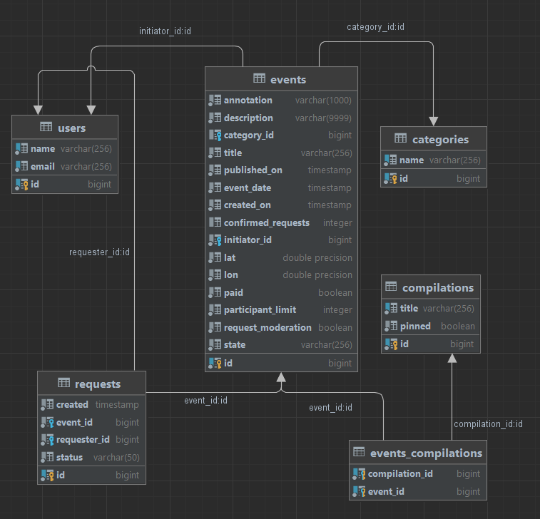
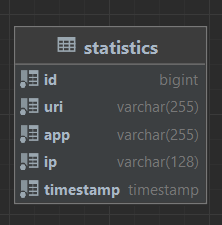

# _REST API BACKEND SERVICE "Explore With Me"_
#### Дипломный проект по курсу Java-developer.
В основе приложения заложена идея делиться информацией об интересных 
событиях и помогать найти компанию для участия в них.
https://github.com/PashaRud/java-explore-with-me

### _Используемые технологии_
- Java 11
- SpringBoot Framework
- PostgreSQL
- JPA, Hibernate
- Docker
- Swagger

## _Структура приложения_

### _Main Service API_
#### Главный сервис реализующий основные функции приложения.
- /users 
- /events  
- /requests
- /compilations
- /categories

### _Statistic server API_
#### Сервис статистики.
- /hit
- /stats
- /views

### _Фичи_
#### Комментарии, лайки и дизлайки.
Реализована возможность комментировать события, ставить лайки или дизлайки, а также менять 
лайки на дизлайки.

### _Main database_
#### База данных хранящая в себе пользователей, события, подборки, запросы и категории

### _Statistic database_
#### База данных статистики, хранящая в себе количество просмотров событий

## _Docker start-up guide_
1. mvn clean package
2. mvn install
3. docker-compose up -d
4. Main service: http://localhost:8080
5. Statistic service: http://localhost:9090